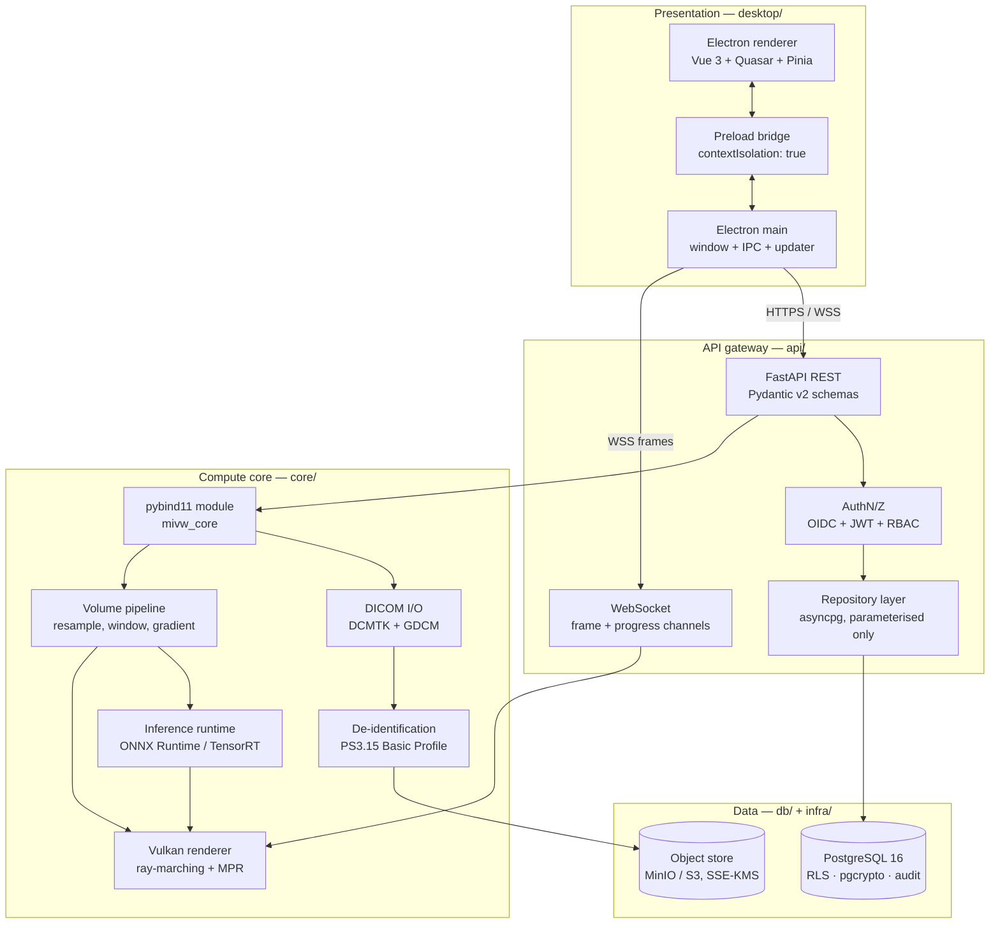
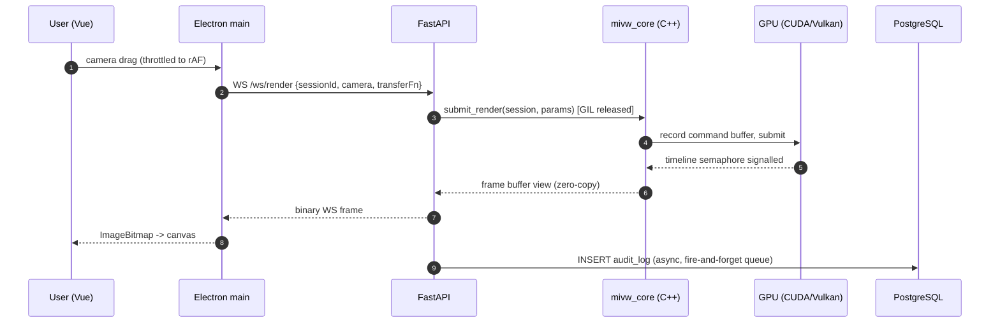
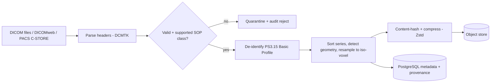

# 01 — Architecture

## 1. Context

MIVW ingests volumetric DICOM studies, runs GPU inference from a pluggable ONNX model
registry, and presents the result through an interactive Vulkan volume renderer inside a
cross-platform desktop shell. The design goal is a **sub-16 ms interaction loop** (60 fps
camera manipulation) with **PHI never leaving a controlled boundary in plaintext**.

## 2. System diagram

## 3. Layer responsibilities

### 3.1 Presentation — `desktop/`

Electron 32 with `contextIsolation: true`, `nodeIntegration: false`, and `sandbox: true`.
The renderer process is a pure Vue 3 SPA (Quasar 2 component library, Pinia stores,
Vue Router). All privileged operations cross a narrow, explicitly enumerated preload
bridge — there is no `remote` module and no unrestricted IPC channel.

Frames arriving from the render stream are decoded into an `ImageBitmap` and blitted to a
`<canvas>` via `transferFromImageBitmap`, which avoids a per-frame copy through JS heap.

### 3.2 API gateway — `api/`

FastAPI provides the REST surface and two WebSocket channels (`/ws/render`, `/ws/jobs`).
Its jobs are: authenticate, authorise, validate, translate, and marshal. It contains **no
imaging logic** — heavy work is delegated to `mivw_core` (pybind11) or to a job queue.

Long-running work (ingest, inference) is dispatched to a worker pool; the request thread
never blocks. GIL-bound sections are released inside the C++ bindings.

### 3.3 Compute core — `core/`

C++20, built with CMake and CUDA 12.x. Exposed to Python as a single `mivw_core`
extension module. Owns DICOM parsing, de-identification, volume preprocessing, ONNX/
TensorRT inference, and the Vulkan renderer. Uses RAII throughout; every GPU allocation is
owned by a handle type with a deleter, so there is no manual `cudaFree`/`vkDestroy*`.

### 3.4 Rendering — `core/vulkan/`

Vulkan 1.3 with dynamic rendering and timeline semaphores. Single-pass ray-marching over
a 3D texture with empty-space skipping from a min/max occupancy grid, plus MPR
(axial/coronal/sagittal) and oblique reformats. Segmentation masks are composited as a
second sampled 3D texture with a per-label colour LUT.

Off-screen rendering only: the swapchain is replaced by an off-screen colour attachment,
which keeps the *same* code path for `local` and `server` modes.

### 3.5 Data — `db/`, object store

PostgreSQL 16 holds metadata, users, annotations, jobs, and the audit trail. Bulk pixel
data lives in an object store keyed by a content hash; the database stores only the key.
This keeps table sizes sane and lets object-level lifecycle/retention policies do the work.

## 4. Interaction data flow

**Latency budget (target, 512³ volume, RTX-class GPU):**

| Stage | Budget |
| --- | --- |
| Input → WS send | 1 ms |
| Gateway dispatch | 1 ms |
| Vulkan ray-march | 8 ms |
| Encode + transfer | 3 ms |
| Decode + blit | 2 ms |
| **Total** | **15 ms** |

## 5. Ingest pipeline

De-identification runs **before** anything is persisted outside the ingest sandbox.
The mapping from original to pseudonymised identifiers is stored encrypted and is
accessible only to the `mivw_reidentify` role.

## 6. Model registry

Models are not hard-coded to a clinical task. A registry row describes each model:

- ONNX artefact + SHA-256 digest (verified before load — supply-chain integrity)
- Declared input tensor spec (shape, spacing, orientation, normalisation)
- Declared output kind: `segmentation` | `classification` | `heatmap` | `landmarks`
- Optional TensorRT engine cache, keyed by `(model_digest, gpu_arch, trt_version)`

The core validates the incoming volume against the declared spec and refuses to run on a
mismatch rather than silently resampling. Every inference writes a provenance record
(model digest, engine hash, driver version, input volume hash) so results are reproducible
and auditable.

## 7. Architecture decision records

| ADR | Decision | Rationale |
| --- | --- | --- |
| [0001](adr/0001-offscreen-vulkan-streaming.md) | Off-screen Vulkan + frame streaming, not an embedded surface | One code path for local and server; avoids fragile Chromium/Vulkan surface interop |
| [0002](adr/0002-pybind11-over-grpc.md) | pybind11 in-process binding, not a gRPC sidecar | Removes a serialisation hop from the hot path; volumes stay in one address space |
| [0003](adr/0003-object-store-for-pixels.md) | Pixel data in object store, metadata in PostgreSQL | Keeps `VACUUM`/backup cost bounded; enables lifecycle retention |
| [0004](adr/0004-rls-for-tenant-isolation.md) | PostgreSQL RLS for authorisation, not app-layer filtering | Isolation survives an application-layer bug |
| [0005](adr/0005-onnx-registry.md) | Pluggable ONNX registry with digest pinning | Task-agnostic; reproducible, auditable inference |

## 8. Cross-cutting concerns

**Observability.** OpenTelemetry traces span the whole path — a trace ID is created in the
renderer, passed over WS, and propagated into C++ spans. Prometheus metrics cover frame
time percentiles, GPU memory, queue depth, and inference latency.

**Configuration.** A single layered config (`defaults → file → env → CLI`) parsed by
Pydantic Settings. `MIVW_MODE` selects the `local`/`server` profile; profiles differ only
in bind address, TLS material, and credential source.

**Error model.** Every failure crossing a boundary becomes a typed problem detail
(RFC 9457). C++ exceptions are translated at the pybind11 boundary; nothing escapes as a
bare `RuntimeError`.

**Backpressure.** The render channel is *latest-wins*: if a new camera state arrives while
a frame is in flight, the queued frame is dropped rather than buffered. This keeps
interaction responsive under GPU contention instead of accumulating lag.
