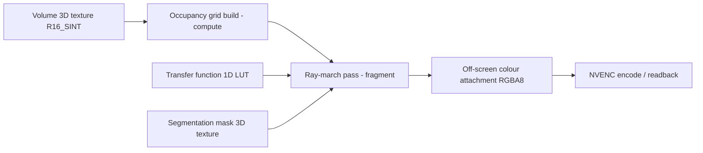

# 02 — Component Breakdown

## Repository layout

```
RealTimeAIPoweredMedicalImageWorkstation/
├── db/                        PostgreSQL schema, migrations, pgTAP tests
│   ├── migrations/            Numbered, forward-only SQL migrations
│   ├── tests/                 pgTAP suites
│   └── seed/                  Non-PHI development fixtures
├── core/                      C++20 / CUDA / Vulkan compute core
│   ├── include/mivw/          Public headers
│   ├── src/                   Implementation
│   ├── cuda/                  .cu kernels
│   ├── vulkan/shaders/        GLSL -> SPIR-V
│   ├── bindings/              pybind11 module definition
│   └── tests/                 GoogleTest suites
├── api/                       FastAPI gateway
│   ├── src/mivw_api/
│   └── tests/
├── desktop/                   Electron + Vue 3 + Quasar client
│   ├── src-electron/          Main + preload
│   ├── src/                   Renderer SPA
│   ├── test/                  Vitest unit tests
│   └── e2e/                   Playwright specs
├── infra/                     Compose files, container definitions
├── scripts/                   Bootstrap and helper scripts
└── docs/
```

---

## 1. Database — `db/`

| Module | Responsibility |
| --- | --- |
| `migrations/` | Forward-only numbered migrations; every one has a matching rollback note |
| `roles.sql` | Least-privilege roles: `mivw_app`, `mivw_readonly`, `mivw_ingest`, `mivw_reidentify` |
| `policies.sql` | Row-Level Security policies keyed on `current_setting('mivw.user_id')` |
| `audit.sql` | Append-only trigger-driven audit trail; `REVOKE UPDATE, DELETE` |
| `tests/` | pgTAP: schema shape, constraint enforcement, RLS bypass attempts |

The application connects as `mivw_app`, which has **no** `BYPASSRLS` and no DDL rights.
Session context (`SET LOCAL mivw.user_id`) is set inside the same transaction as every
query, so a leaked connection from the pool cannot carry another user's context.

## 2. Compute core — `core/`

| Module | Header | Responsibility |
| --- | --- | --- |
| `dicom` | `mivw/dicom/reader.hpp` | DCMTK-backed parsing, SOP class validation, series sorting |
| `deid` | `mivw/dicom/deidentifier.hpp` | PS3.15 Basic Profile tag removal/hashing, pseudonym mint |
| `volume` | `mivw/volume/volume.hpp` | Typed voxel buffer, spacing/orientation, iso-voxel resample |
| `cuda` | `mivw/cuda/*.hpp` | RAII device buffers, stream pool, windowing/gradient kernels |
| `infer` | `mivw/infer/runtime.hpp` | ONNX Runtime + TensorRT EP, engine cache, digest verification |
| `render` | `mivw/render/renderer.hpp` | Vulkan device, off-screen targets, ray-march + MPR passes |
| `codec` | `mivw/codec/encoder.hpp` | GPU frame encode (NVENC H.264/HEVC, PNG fallback) |
| `bindings` | `bindings/module.cpp` | pybind11 surface, exception translation, GIL release |

**Ownership rules.** No raw owning pointers. `VkDevice`, `VkImage`, `cudaStream_t`,
`OrtSession` are each wrapped in a move-only handle. `Volume` is move-only and never
implicitly copied — an accidental copy of a 512³ `int16` volume is 256 MB.

**GIL discipline.** Every binding that can run longer than ~100 µs wraps its body in
`py::gil_scoped_release`. Callbacks back into Python re-acquire explicitly.

### Vulkan renderer internals



Frames-in-flight = 2, synchronised with timeline semaphores. Descriptor sets are
bindless-style (one large descriptor array) to avoid per-frame set allocation.

## 3. API gateway — `api/`

| Module | Responsibility |
| --- | --- |
| `main.py` | App factory, lifespan (core init, pool warm-up), middleware chain |
| `config.py` | Pydantic Settings; `MIVW_MODE` profile resolution |
| `security/` | OIDC discovery, JWT verification (JWKS cache), RBAC dependency |
| `routers/` | `studies`, `series`, `render`, `models`, `jobs`, `annotations`, `admin` |
| `schemas/` | Pydantic v2 request/response models — the single source of API truth |
| `repositories/` | asyncpg data access; parameterised statements only |
| `services/` | Orchestration between repositories, core, and object store |
| `ws/` | Render + job WebSocket handlers, latest-wins backpressure |
| `workers/` | Ingest and inference task execution, progress reporting |

**Middleware chain (outermost first):** request ID → OpenTelemetry → security headers →
CORS (deny by default) → rate limit → auth → body size limit → problem-detail handler.

## 4. Desktop client — `desktop/`

| Module | Responsibility |
| --- | --- |
| `src-electron/main/` | Window lifecycle, CSP injection, auto-update, single-instance lock |
| `src-electron/preload/` | Typed `contextBridge` API — the only renderer privilege surface |
| `src/stores/` | Pinia: `auth`, `studies`, `viewport`, `annotations`, `jobs`, `models` |
| `src/components/viewer/` | `VolumeCanvas`, `MprPane`, `ViewportToolbar`, `SeriesRail` |
| `src/components/controls/` | `TransferFunctionEditor`, `WindowLevelControl`, `LabelLegend` |
| `src/components/worklist/` | `StudyTable`, `StudyFilters`, `IngestDropZone` |
| `src/composables/` | `useRenderStream`, `useKeyboardShortcuts`, `useMeasurement` |
| `src/services/` | Generated API client (from OpenAPI), WS transport, retry/backoff |

**Preload surface** is deliberately tiny:

```ts
// src-electron/preload/api.ts
export interface MivwBridge {
  connectRenderStream(sessionId: string): Promise<void>;
  onFrame(cb: (frame: ArrayBuffer, seq: number) => void): () => void;
  sendCamera(state: CameraState): void;
  pickFilesForIngest(): Promise<string[]>;   // native dialog, returns paths only
  getAppInfo(): AppInfo;
}
```

No `fs`, no `child_process`, no arbitrary IPC channel name is reachable from the renderer.

## 5. Component interaction contract

| Boundary | Mechanism | Failure translation |
| --- | --- | --- |
| Renderer ↔ Main | `contextBridge` typed IPC | Rejected promise with `code` |
| Main ↔ API | HTTPS + WSS, JWT bearer | RFC 9457 problem detail |
| API ↔ Core | pybind11 in-process call | C++ exception → typed Python exception |
| Core ↔ GPU | CUDA/Vulkan | Result codes checked at every call; device-lost triggers renderer rebuild |
| API ↔ PostgreSQL | asyncpg pool | Constraint violation → 409, RLS empty result → 404 (never 403, to avoid existence leak) |

## 6. Build artefacts

| Artefact | Produced by | Consumed by |
| --- | --- | --- |
| `mivw_core.<abi>.so/.pyd` | CMake + scikit-build-core | `api/` |
| `*.spv` | `glslc` at build time, embedded | `core/render` |
| `openapi.json` | FastAPI export task | `desktop/` client codegen |
| `mivw-workstation` installer | electron-builder | End user |
