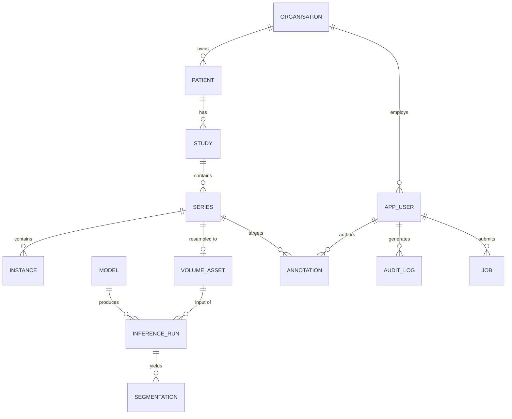

# 03 — Data Model

## 1. Principles

1. **Metadata in PostgreSQL, pixels in object storage.** Rows stay small; backup and
   `VACUUM` cost stays bounded.
2. **Direct identifiers are encrypted at column level** with `pgcrypto`, keyed by a key
   held outside the database. A database dump alone does not disclose PHI.
3. **Row-Level Security is the authorisation boundary.** Application filtering is a
   convenience, not a control.
4. **The audit trail is append-only.** `UPDATE` and `DELETE` are revoked from every role.
5. **Forward-only migrations.** Numbered, immutable once merged.

## 2. Entity relationships



## 3. Core tables

### `organisation`
Tenant root. Every PHI-bearing row carries `org_id`, and every RLS policy keys on it.

### `app_user`
| Column | Type | Notes |
| --- | --- | --- |
| `id` | `uuid` PK | |
| `org_id` | `uuid` FK | |
| `subject` | `text` UNIQUE | OIDC `sub`; no local password storage |
| `role` | `mivw_role` enum | `viewer` \| `annotator` \| `researcher` \| `admin` |
| `is_active` | `boolean` | Deactivation is the only "delete" |

Authentication is delegated to an external OIDC provider. **No password hashes are stored**,
which removes an entire class of credential-breach exposure.

### `patient`
| Column | Type | Notes |
| --- | --- | --- |
| `id` | `uuid` PK | Internal surrogate |
| `org_id` | `uuid` FK | |
| `pseudonym` | `text` UNIQUE | Stable non-reversible display ID |
| `mrn_enc` | `bytea` | `pgp_sym_encrypt` — direct identifier |
| `name_enc` | `bytea` | `pgp_sym_encrypt` — direct identifier |
| `mrn_hmac` | `bytea` | HMAC-SHA256, keyed — enables equality lookup without decryption |
| `birth_year` | `smallint` | Coarsened from full DOB (HIPAA Safe Harbor) |
| `sex` | `text` | |

`mrn_hmac` is the searchable index: deterministic encryption would leak frequency, and
searching the ciphertext directly is impossible. Only `mivw_reidentify` may call decrypt.

### `study` / `series` / `instance`
DICOM hierarchy. UIDs are stored **pseudonymised** — the original UIDs are replaced during
de-identification and the mapping lives in the encrypted `deid_map` table.

`series` carries the geometry that the renderer needs: `rows`, `columns`, `slice_count`,
`pixel_spacing`, `slice_thickness`, `image_orientation`, `image_position`, `modality`,
`rescale_slope`, `rescale_intercept`.

### `volume_asset`
| Column | Type | Notes |
| --- | --- | --- |
| `id` | `uuid` PK | |
| `series_id` | `uuid` FK UNIQUE | |
| `object_key` | `text` | Object-store key |
| `content_sha256` | `bytea` | Integrity + deduplication |
| `dims` | `integer[3]` | |
| `spacing_mm` | `double precision[3]` | |
| `dtype` | `text` | `int16` \| `uint16` \| `float32` |
| `compression` | `text` | `zstd` |
| `size_bytes` | `bigint` | |

### `model`
| Column | Type | Notes |
| --- | --- | --- |
| `id` | `uuid` PK | |
| `name`, `version` | `text` | UNIQUE together |
| `artifact_key` | `text` | Object-store key of the ONNX file |
| `artifact_sha256` | `bytea` | **Verified before every load** |
| `output_kind` | `model_output_kind` enum | `segmentation` \| `classification` \| `heatmap` \| `landmarks` |
| `input_spec` | `jsonb` | Shape, spacing, orientation, normalisation |
| `label_map` | `jsonb` | Label index → name + display colour |
| `is_enabled` | `boolean` | |

`input_spec` is validated against a JSON Schema by a `CHECK` constraint, so a malformed
registry entry is rejected at write time rather than at inference time.

### `inference_run`
Provenance record: `model_id`, `volume_asset_id`, `input_sha256`, `engine_cache_key`,
`gpu_name`, `driver_version`, `runtime_version`, `started_at`, `finished_at`, `status`,
`metrics jsonb`. This is what makes a result reproducible and defensible.

### `annotation`
`series_id`, `author_id`, `kind` (`measurement` \| `roi` \| `note` \| `label_edit`),
`payload jsonb`, `frame_of_reference`, timestamps. Geometry is stored in **patient
coordinates (mm)**, never pixel indices, so annotations survive resampling.

### `job`
Async work queue: `kind` (`ingest` \| `inference` \| `export`), `status`, `progress`,
`payload jsonb`, `error jsonb`, `submitted_by`, `attempts`. Claimed with
`SELECT ... FOR UPDATE SKIP LOCKED` so multiple workers never double-process.

### `audit_log`
| Column | Type |
| --- | --- |
| `id` | `bigint` GENERATED ALWAYS AS IDENTITY |
| `occurred_at` | `timestamptz DEFAULT now()` |
| `actor_id` | `uuid` |
| `action` | `text` |
| `resource_type`, `resource_id` | `text`, `uuid` |
| `outcome` | `text` (`success` \| `denied` \| `error`) |
| `context` | `jsonb` (IP, user agent, trace ID) |

`REVOKE UPDATE, DELETE ON audit_log FROM PUBLIC` plus a `BEFORE UPDATE OR DELETE` trigger
that raises. Every PHI read is logged — HIPAA §164.312(b) requires the *access* record,
not just the mutation record.

## 4. Row-Level Security

```sql
ALTER TABLE study ENABLE ROW LEVEL SECURITY;
ALTER TABLE study FORCE ROW LEVEL SECURITY;

CREATE POLICY study_tenant_isolation ON study
    USING (org_id = current_setting('mivw.org_id', true)::uuid);

CREATE POLICY study_write_requires_role ON study
    FOR INSERT WITH CHECK (
        org_id = current_setting('mivw.org_id', true)::uuid
        AND current_setting('mivw.role', true) IN ('annotator', 'researcher', 'admin')
    );
```

`FORCE ROW LEVEL SECURITY` matters: without it the table owner bypasses its own policies.

Session context is set inside each transaction:

```sql
SET LOCAL mivw.org_id  = $1;
SET LOCAL mivw.user_id = $2;
SET LOCAL mivw.role    = $3;
```

`SET LOCAL` (not `SET`) ensures the context dies with the transaction and cannot leak to
the next borrower of a pooled connection.

## 5. Indexing

| Index | Purpose |
| --- | --- |
| `study (org_id, study_datetime DESC)` | Worklist default sort — matches the RLS predicate leading column |
| `patient (org_id, mrn_hmac)` | Identifier lookup without decryption |
| `series (study_id, series_number)` | Series rail ordering |
| `job (status, kind) WHERE status IN ('queued','running')` | Partial index; queue stays small |
| `annotation USING GIN (payload jsonb_path_ops)` | Attribute search |
| `audit_log (occurred_at DESC)` BRIN | Append-only time-ordered data — BRIN is far cheaper than B-tree here |

`audit_log` is `PARTITION BY RANGE (occurred_at)` monthly, so retention is a `DETACH`
rather than a mass `DELETE`.

## 6. Migrations

Forward-only, numbered `NNNN_description.sql`, applied in a transaction with an advisory
lock so concurrent deployments cannot race.

```
db/migrations/
├── 0001_extensions.sql          pgcrypto, pg_stat_statements, uuid-ossp
├── 0002_roles.sql               Least-privilege roles and grants
├── 0003_core_tables.sql         organisation, app_user
├── 0004_dicom_hierarchy.sql     patient, study, series, instance
├── 0005_volume_assets.sql       volume_asset, deid_map
├── 0006_models_inference.sql    model, inference_run, segmentation
├── 0007_annotations_jobs.sql    annotation, job
├── 0008_audit.sql               audit_log, partitions, triggers
└── 0009_rls_policies.sql        RLS enablement and policies
```

RLS is enabled **last** so that earlier migrations are readable in isolation, and it is
covered by dedicated pgTAP tests that attempt cross-tenant reads and assert zero rows.

## 7. Retention and erasure

| Data | Retention | Erasure mechanism |
| --- | --- | --- |
| Pixel data | Per-study policy, default 7 years | Object-store lifecycle rule |
| Metadata | Same as pixel data | Cascade from `study` |
| `deid_map` | Configurable; deletable independently | Deleting the map renders remaining data irreversibly anonymous |
| `audit_log` | 6 years minimum | Partition `DETACH` + archive |

GDPR Article 17 erasure is satisfied by deleting the `deid_map` row: the retained data is
then anonymous rather than pseudonymous and falls outside the scope of the regulation.
