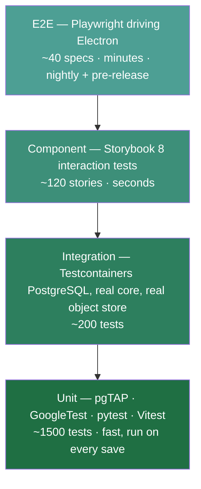

# 05 — Testing Strategy

## 1. Shape of the suite



**Rule:** a bug gets a regression test at the *lowest* layer that can reproduce it.
E2E specs cover user journeys, not edge cases.

## 2. Per-layer tooling

| Layer | Runner | Coverage gate | Notes |
| --- | --- | --- | --- |
| PostgreSQL | pgTAP + Testcontainers | every table, constraint, policy | Schema is code; it gets tests |
| C++/CUDA | GoogleTest + CTest | 80 % line on `core/src` | Plus `compute-sanitizer`, ASan/UBSan builds |
| Python | pytest + pytest-asyncio | 85 % on `mivw_api` | Plus Schemathesis contract fuzzing |
| Vue/TS | Vitest + `@vue/test-utils` | 80 % on stores/composables | jsdom environment |
| Component | Storybook 8 test-runner | all interactive components | Also drives a11y and visual regression |
| E2E | Playwright `_electron` | critical journeys | Runs the packaged binary |

## 3. Database — pgTAP

Tests run against a throwaway container seeded by the real migrations, so the migration
path itself is exercised.

```sql
-- db/tests/030_rls_isolation.sql
BEGIN;
SELECT plan(4);

SELECT has_table('study');
SELECT ok(
    (SELECT relrowsecurity AND relforcerowsecurity
     FROM pg_class WHERE relname = 'study'),
    'study has RLS enabled AND forced'
);

-- Tenant A must not observe tenant B's rows.
SET LOCAL ROLE mivw_app;
SET LOCAL mivw.org_id = '11111111-1111-1111-1111-111111111111';
SELECT is((SELECT count(*) FROM study WHERE org_id
           = '22222222-2222-2222-2222-222222222222'), 0::bigint,
          'cross-tenant read returns zero rows');

SELECT throws_ok(
    $$ DELETE FROM audit_log WHERE true $$,
    NULL, NULL,
    'audit_log rejects deletion'
);

SELECT * FROM finish();
ROLLBACK;
```

**Mandatory database test categories:** schema shape, NOT NULL/CHECK/FK enforcement,
RLS isolation (positive and negative), audit immutability, role grant minimality,
migration idempotency, and index presence for every query in `repositories/`.

## 4. C++/CUDA — GoogleTest

```cpp
// core/tests/volume/resample_test.cpp
TEST(Resample, PreservesPhysicalExtentWithinHalfVoxel) {
    auto src = makeVolume({256, 256, 120}, {0.7, 0.7, 3.0});
    auto dst = resampleIsotropic(src, 1.0);

    for (int axis = 0; axis < 3; ++axis) {
        const double srcExtent = src.dims()[axis] * src.spacing()[axis];
        const double dstExtent = dst.dims()[axis] * dst.spacing()[axis];
        EXPECT_NEAR(srcExtent, dstExtent, 0.5) << "axis " << axis;
    }
}

TEST(DeIdentifier, RemovesEveryBasicProfileTag) {
    auto ds = loadFixture("fixtures/synthetic_ct_with_phi.dcm");
    DeIdentifier{DeIdPolicy::basicProfile()}.apply(ds);

    for (const auto& tag : DeIdPolicy::basicProfile().removedTags()) {
        EXPECT_FALSE(ds.hasTag(tag)) << "leaked tag " << tag;
    }
}
```

**GPU tests** run in a `cuda` CTest label, skipped gracefully when no device is present so
laptops can still run the suite. Kernel correctness is checked against a CPU reference
implementation with an explicit tolerance. Every CI GPU run also executes under
`compute-sanitizer --tool memcheck` and `--tool racecheck`.

**Renderer tests** are golden-image: render a deterministic phantom volume with a fixed
camera and compare against a checked-in PNG using a perceptual metric (SSIM ≥ 0.995), not
exact equality — driver revisions legitimately change the last bit.

**Fixtures contain no real patient data.** `synthetic_ct_with_phi.dcm` is generated by a
script that inserts *fake* identifiers, so the de-identification test has something to
strip without any PHI entering the repository.

## 5. Python — pytest

```python
# api/tests/routers/test_studies.py
async def test_study_from_other_org_returns_404_not_403(client, seeded_orgs):
    """Existence must not leak. RLS filters the row; the API must not
    distinguish 'forbidden' from 'absent'."""
    token = issue_token(org_id=seeded_orgs.a, role="viewer")
    resp = await client.get(
        f"/api/v1/studies/{seeded_orgs.b_study_id}",
        headers={"Authorization": f"Bearer {token}"},
    )
    assert resp.status_code == 404
    assert "org" not in resp.text.lower()


@pytest.mark.parametrize("payload", MALFORMED_MODEL_SPECS)
async def test_model_registration_rejects_bad_spec(client, admin_token, payload):
    resp = await client.post("/api/v1/models", json=payload,
                             headers={"Authorization": f"Bearer {admin_token}"})
    assert resp.status_code == 422
    assert resp.headers["content-type"].startswith("application/problem+json")
```

**Security-focused test set (required, non-negotiable):**

- Expired, `alg: none`, wrong-`aud`, and wrong-issuer tokens are all rejected.
- Every endpoint is exercised unauthenticated and asserts 401.
- Every endpoint is exercised with an insufficient role and asserts 403/404.
- SQL metacharacters in every string parameter — assert no error-message leakage and no
  behavioural difference (parameterisation proof).
- Response bodies and log output are scanned for PHI field names.
- Schemathesis runs the OpenAPI document as a property-based fuzz target; any 500 fails.

## 6. Frontend unit — Vitest

```ts
// desktop/test/stores/viewport.spec.ts
describe('viewport store', () => {
  it('drops superseded frames rather than rendering them out of order', () => {
    const store = useViewportStore();
    store.acceptFrame({ seq: 10, bitmap: fakeBitmap() });
    store.acceptFrame({ seq: 12, bitmap: fakeBitmap() });
    store.acceptFrame({ seq: 11, bitmap: fakeBitmap() }); // late arrival
    expect(store.currentSeq).toBe(12);
    expect(store.droppedFrames).toBe(1);
  });

  it('clamps window width to a positive value', () => {
    const store = useViewportStore();
    store.setWindow({ center: 40, width: -100 });
    expect(store.window.width).toBeGreaterThan(0);
  });
});
```

Scope: Pinia stores, composables, coordinate transforms (pixel ↔ patient mm), formatting,
and the WS transport's reconnect/backoff logic with a mocked socket.

## 7. Component — Storybook 8

Every interactive component ships a story set: default, loading, empty, error, and a
`play` function asserting behaviour.

```ts
// desktop/src/components/controls/WindowLevelControl.stories.ts
export const KeyboardAdjustable: Story = {
  args: { center: 40, width: 400 },
  play: async ({ canvasElement, args }) => {
    const canvas = within(canvasElement);
    const slider = canvas.getByRole('slider', { name: /window width/i });
    await userEvent.type(slider, '{ArrowRight>10/}');
    await expect(args.onChange).toHaveBeenLastCalledWith(
      expect.objectContaining({ width: 410 }),
    );
  },
};
```

The Storybook test-runner additionally executes `axe-core` on every story. Accessibility
violations fail the build — a clinical tool that only works with a mouse is not acceptable.
Chromatic (or Playwright screenshots) provides visual regression on the same stories.

## 8. E2E — Playwright

```ts
// desktop/e2e/inference.spec.ts
test('researcher runs a registered model and sees the overlay', async () => {
  const app = await electron.launch({ args: ['dist/electron/main.js'],
                                      env: { MIVW_MODE: 'local', MIVW_E2E: '1' } });
  const win = await app.firstWindow();

  await win.getByRole('row', { name: /PHANTOM-001/ }).click();
  await win.getByRole('button', { name: 'Run model' }).click();
  await win.getByRole('option', { name: 'liver-seg 1.4.0' }).click();
  await win.getByRole('button', { name: 'Start' }).click();

  await expect(win.getByRole('progressbar')).toBeVisible();
  await expect(win.getByTestId('segmentation-overlay'))
    .toBeVisible({ timeout: 120_000 });
  await expect(win.getByText('liver')).toBeVisible();

  await app.close();
});
```

**Journeys covered:** login/logout and token expiry; ingest a synthetic study; browse the
worklist and open a series; manipulate the volume and confirm frames advance; MPR
navigation; register and run a model; create/edit/delete an annotation and verify it
persists across restart; permission denial for a `viewer` attempting an annotation.

E2E always runs against a seeded synthetic dataset in a disposable container stack. It
never touches a real PACS.

## 9. Non-functional testing

| Kind | Tool | Gate |
| --- | --- | --- |
| Render performance | Custom harness over `/ws/render` | p95 frame time ≤ 16 ms on reference GPU |
| API load | k6 | p95 ≤ 150 ms at 50 concurrent viewers |
| Memory leaks | Valgrind (CPU), long-soak session with GPU memory sampling | Flat over 8 h |
| Dependency vulnerabilities | `pip-audit`, `npm audit`, `osv-scanner` | No high/critical |
| SAST | CodeQL (C++, Python, TS), `clang-tidy`, `ruff`, `eslint` | Zero new findings |
| Secrets | `gitleaks` pre-commit + CI | Zero |
| Container | Trivy | No high/critical |

## 10. CI execution matrix

| Trigger | Suites |
| --- | --- |
| Pre-commit | format, lint, `gitleaks`, changed-file unit tests |
| Pull request | all unit + integration + component, SAST, dependency audit |
| Merge to `main` | above + GPU tests + E2E on Linux |
| Nightly | full E2E on Linux/Windows/macOS, soak, performance, visual regression |
| Release tag | everything + signed artefact build + SBOM generation |

## 11. Definition of Done

A story is done when: unit tests cover new logic at the lowest applicable layer; any new
component has stories including error and empty states; any new endpoint has authz-denial
tests; any schema change has pgTAP coverage; coverage gates hold; docs updated; no new
SAST or dependency findings.
