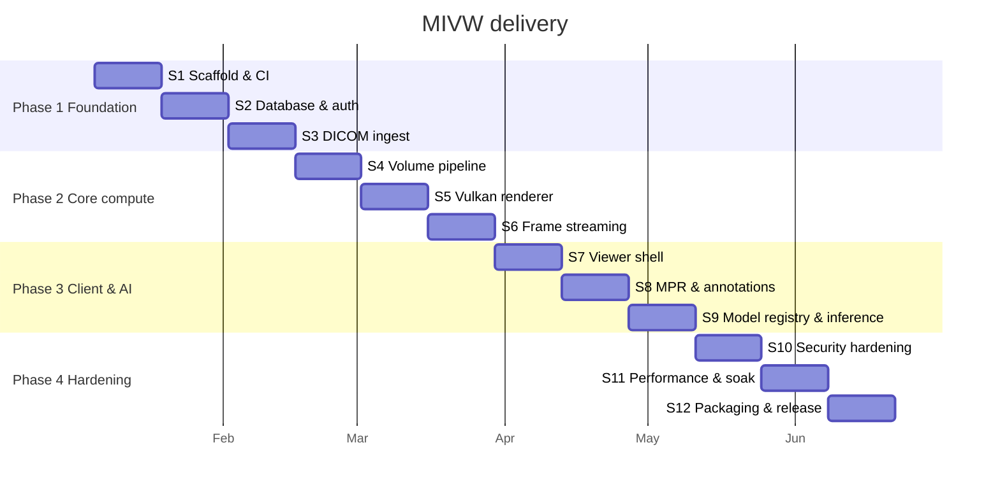

# 07 — Project Plan (12 Sprints)

Two-week sprints, four phases. Each sprint lists its **goal**, **epics**, **stories**, and
a **demoable outcome** — if there is nothing to show, the sprint was mis-scoped.

## Team shape

| Role | Count | Focus |
| --- | --- | --- |
| Graphics/GPU engineer (C++) | 2 | `core/` — Vulkan, CUDA, DICOM |
| Backend engineer (Python) | 2 | `api/`, `db/`, workers |
| Frontend engineer (TS/Vue) | 2 | `desktop/` |
| DevOps / QA | 1 | CI/CD, test infrastructure, packaging |
| Product / clinical advisor | 0.5 | Requirements, validation, domain review |

## Cross-sprint standing rules

- Every sprint ends with green CI on all suites; a red pipeline blocks the demo.
- Test work is inside the story, never a follow-up ticket.
- Documentation changes ship in the same PR as the behaviour change.
- 15 % of each sprint is reserved for defects and unplanned work.

---

# Phase 1 — Foundation (S1–S3)

## Sprint 1 — Scaffold, toolchain, CI

**Goal:** every layer builds and its (trivial) test suite runs in CI on three platforms.

| Epic | Stories |
| --- | --- |
| Monorepo | Directory layout; root `Makefile`; `.editorconfig`; licence and third-party notices |
| C++ toolchain | CMake presets; CUDA + Vulkan SDK detection; `FetchContent` for DCMTK, pybind11, GoogleTest; hello-world `mivw_core` importable from Python |
| Python toolchain | `uv` + `pyproject.toml`; FastAPI app factory; `/healthz`; ruff + mypy strict |
| Frontend toolchain | Quasar CLI scaffold; Electron main/preload with hardened `webPreferences`; Vitest + Storybook + Playwright wired |
| CI/CD | GitHub Actions matrix (Ubuntu/Windows/macOS); caching; `gitleaks` + pre-commit; branch protection |

**Demo:** `make all && make test` green locally and in CI; Electron window opens and calls `/healthz`.

## Sprint 2 — Database, migrations, authentication

**Goal:** a secured, tested data layer with real authentication end to end.

| Epic | Stories |
| --- | --- |
| Schema | Migrations 0001–0004; migration runner with advisory lock; seed fixtures (synthetic only) |
| Security | Least-privilege roles; RLS policies with `FORCE`; `pgcrypto` identifier columns; HMAC lookup column |
| Audit | `audit_log` with monthly partitions, immutability trigger, revoked grants |
| Auth | OIDC integration; JWKS cache; JWT verification; RBAC dependency; token refresh in Electron main |
| Tests | pgTAP suites for schema, RLS isolation, audit immutability, grant minimality; pytest authz-denial matrix |

**Demo:** log in through the identity provider; tenant A provably cannot read tenant B's seeded rows; every access appears in the audit log.

**Risk:** RLS session-context handling with a connection pool is the classic source of
cross-tenant leaks. Mitigated by `SET LOCAL` inside the transaction and a dedicated pgTAP
test that reuses a pooled connection across simulated users.

## Sprint 3 — DICOM ingest and de-identification

**Goal:** a study can be ingested, de-identified, and catalogued.

| Epic | Stories |
| --- | --- |
| Parsing | DCMTK reader; SOP class allow-list; series sorting by `ImagePositionPatient`; geometry extraction; malformed-file quarantine |
| De-identification | PS3.15 Basic Profile; consistent UID pseudonymisation; date coarsening; burned-in-annotation detection and quarantine; encrypted `deid_map` |
| Storage | Object-store client; content-hash keys; Zstd compression; presigned upload sessions |
| Jobs | `job` table; `SKIP LOCKED` claiming; worker pool; `/ws/jobs` progress channel |
| Tests | GoogleTest tag-leak assertions; synthetic PHI fixture generator; integration test from upload to catalogued study |

**Demo:** drop a synthetic study into the ingest zone; watch progress stream; see it appear in the worklist with all identifiers pseudonymised.

---

# Phase 2 — Core compute (S4–S6)

## Sprint 4 — Volume pipeline and CUDA

**Goal:** DICOM series become GPU-resident, correctly-scaled volumes.

| Epic | Stories |
| --- | --- |
| Volume type | Move-only typed voxel buffer; spacing/orientation/direction cosines; patient↔voxel transforms |
| Resampling | Isotropic resample (trilinear + Lanczos); `RescaleSlope`/`Intercept` → HU |
| CUDA | RAII device buffers and stream pool; window/level, gradient, and histogram kernels; pinned-memory staging |
| Occupancy | Min/max occupancy grid for empty-space skipping |
| Tests | CPU-reference kernel comparisons; extent-preservation properties; `compute-sanitizer` in CI |

**Demo:** headless tool loads a study and emits a histogram plus timing table; sanitizer clean.

## Sprint 5 — Vulkan renderer

**Goal:** correct off-screen volume rendering.

| Epic | Stories |
| --- | --- |
| Device | Instance/device creation, validation layers in debug, queue selection, VMA allocator |
| Resources | 3D texture upload, transfer-function LUT, off-screen colour attachment, timeline semaphores |
| Ray marching | Single-pass GLSL ray marcher with early-ray termination and empty-space skipping; Phong lighting from gradients |
| Presets | CT bone/lung/soft-tissue and MR transfer-function presets |
| Tests | Golden-image SSIM tests on a deterministic phantom; validation-layer-clean assertion; device-lost recovery test |

**Demo:** CLI renders a phantom and a real synthetic CT to PNG from scripted camera angles.

## Sprint 6 — Frame streaming and render sessions

**Goal:** interactive frames reach a browser context at target latency.

| Epic | Stories |
| --- | --- |
| Encoding | NVENC H.264 path with PNG fallback; binary frame header; codec negotiation |
| Sessions | `POST /render/sessions`; GPU-memory pinning; idle expiry; per-user session cap |
| Transport | `/ws/render` handler; latest-wins backpressure; server-driven interactive/still quality ladder |
| Bindings | pybind11 surface with GIL release; C++→Python exception translation |
| Telemetry | Frame-time histogram, GPU memory gauge, queue depth; OpenTelemetry propagation into C++ |

**Demo:** a throwaway HTML page streams live frames while dragging the mouse; p95 frame time reported under 16 ms.

---

# Phase 3 — Client and AI (S7–S9)

## Sprint 7 — Viewer shell

**Goal:** the real client replaces the throwaway page.

| Epic | Stories |
| --- | --- |
| Shell | Quasar layout, routing, theming (dark default for reading), RUO disclaimer gate |
| Worklist | `StudyTable` with keyset pagination, filters, series rail |
| Viewport | `VolumeCanvas` with `ImageBitmap` blitting; orbit/pan/zoom; window/level drag; frame-drop handling |
| Controls | `TransferFunctionEditor`, `WindowLevelControl`, preset picker |
| State | Pinia stores; generated API client; WS transport with reconnect and backoff |
| Tests | Vitest store/composable coverage; Storybook stories with `play` functions and axe checks; first Playwright journey |

**Demo:** log in, browse the worklist, open a study, manipulate the volume interactively.

## Sprint 8 — MPR, measurement, annotations

**Goal:** the workstation becomes clinically *useful* (still RUO).

| Epic | Stories |
| --- | --- |
| MPR | Axial/coronal/sagittal panes; synchronised crosshair; slab thickness/MIP; oblique reformat |
| Measurement | Distance, angle, ellipse ROI with mean/SD/area in patient mm; HU probe |
| Annotations | CRUD against the API; patient-coordinate storage; author attribution; conflict handling |
| Layout | 1×1 / 2×2 / MPR presets; per-viewport state; keyboard shortcuts; full-screen |
| Tests | Coordinate-transform unit tests; annotation persistence E2E across app restart |

**Demo:** measure a lesion in MPR, save the annotation, restart the app, annotation is exactly where it was left.

## Sprint 9 — Model registry and inference

**Goal:** bring-your-own ONNX models run and overlay.

| Epic | Stories |
| --- | --- |
| Registry | `model` table; `POST /models` with digest verification; `validate` dry-run; admin UI |
| Runtime | ONNX Runtime with TensorRT execution provider; engine cache keyed on `(digest, arch, trt_version)`; sliding-window inference for large volumes |
| Validation | Input-spec conformance check with explicit rejection on mismatch; provenance recording |
| Overlay | Segmentation as a second 3D texture; per-label colour LUT; opacity control; label legend with visibility toggles |
| Tests | Fixed-seed inference determinism; spec-mismatch rejection; overlay golden images; full inference E2E |

**Demo:** register an ONNX segmentation model, run it on a synthetic study, toggle labels over the rendered volume.

---

# Phase 4 — Hardening and release (S10–S12)

## Sprint 10 — Security hardening

| Epic | Stories |
| --- | --- |
| Pen-test remediation | Third-party or internal assessment; fix all high/critical |
| Electron | CSP enforcement, navigation blocking, permission denial, ASAR integrity, signing/notarisation |
| API | Rate limiting, body limits, WS origin checks, security headers, PHI redaction filter |
| Supply chain | CycloneDX SBOM, cosign signing, `osv-scanner` gate |
| Compliance | Complete the control mapping in doc 06; audit-log completeness review |
| Tests | Schemathesis fuzz gate; full authz-denial matrix; PHI-in-logs scanner test |

**Demo:** security review walkthrough with the control matrix and a clean scan report.

## Sprint 11 — Performance, soak, accessibility

| Epic | Stories |
| --- | --- |
| Render perf | Profile with Nsight; tune step size, occupancy grid, descriptor strategy; hit p95 ≤ 16 ms at 512³ |
| API perf | k6 load profile; connection-pool and index tuning; p95 ≤ 150 ms at 50 concurrent viewers |
| Stability | 8-hour soak with GPU/host memory sampling; device-lost recovery; network-drop reconnection |
| Accessibility | Full keyboard operability, focus management, screen-reader labels, contrast audit |
| Large data | 1024³ volumes via bricked/out-of-core streaming |

**Demo:** performance report against targets; soak graph flat; complete keyboard-only walkthrough.

## Sprint 12 — Packaging, docs, release

| Epic | Stories |
| --- | --- |
| Packaging | electron-builder for Windows/macOS/Linux; signed installers; auto-update channel |
| Deployment | `server`-mode container images; compose and Helm manifests; mTLS provisioning |
| Operations | Backup/restore runbook; key-rotation runbook; incident-response runbook; upgrade guide |
| Documentation | User guide, admin guide, API reference publication, model-integration guide |
| Release | Release candidate, UAT with clinical advisor, defect burn-down, v1.0.0 tag with SBOM |

**Demo:** clean install of the signed build on all three platforms, connected to a `server`-mode deployment.

---

## Risk register

| # | Risk | Likelihood | Impact | Mitigation |
| --- | --- | --- | --- | --- |
| R1 | Vulkan driver variability across vendors | High | High | Golden images with perceptual tolerance; test on NVIDIA/AMD/Intel from S5; validation layers always on in CI |
| R2 | Frame latency target missed | Medium | High | Latency budget measured from S6, not S11; quality ladder gives headroom |
| R3 | Cross-tenant PHI leak via RLS misuse | Low | Critical | Dual enforcement (API + RLS), dedicated pooled-connection tests, S10 pen test |
| R4 | Burned-in PHI reaches storage | Medium | Critical | Quarantine at-risk modalities by default in S3 |
| R5 | TensorRT/driver version churn breaks engine cache | Medium | Medium | Cache keyed on driver/TRT version; automatic rebuild on miss |
| R6 | Electron + GPU memory pressure on modest hardware | Medium | Medium | Server mode offloads; documented minimum spec |
| R7 | Scope creep toward clinical use | Medium | Critical | RUO gate in product and docs; any change requires a regulatory decision first |
| R8 | GPU CI runner availability | Medium | Medium | GPU suites labelled and skippable; self-hosted runner provisioned in S1 |

## Milestones

| Milestone | End of | Criterion |
| --- | --- | --- |
| M1 Foundation | S3 | Ingest → catalogued, de-identified study, fully audited |
| M2 Rendering | S6 | Interactive streamed rendering at target latency |
| M3 Feature complete | S9 | MPR, annotations, and BYO-model inference working |
| M4 Release | S12 | Signed cross-platform build, docs, runbooks, SBOM |
