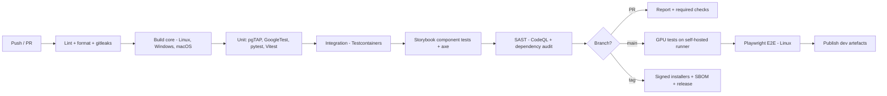

# 08 — Development Environment

## 1. Prerequisites

| Tool | Version | Notes |
| --- | --- | --- |
| CMake | ≥ 3.28 | Presets, CUDA/Vulkan discovery |
| C++ compiler | GCC 13 / Clang 17 / MSVC 19.38 | C++20 required |
| CUDA Toolkit | 12.4+ | Compute capability ≥ 7.5 |
| Vulkan SDK | 1.3.280+ | Provides `glslc`, validation layers |
| Python | 3.12 | Managed with `uv` |
| Node.js | 20 LTS | |
| PostgreSQL client | 16 | `psql`, `pg_dump` |
| Docker | 24+ | Compose v2, Testcontainers |
| Git LFS | any | Test fixtures and golden images |

**GPU:** NVIDIA RTX 3060 (12 GB) minimum for development; 24 GB recommended for 1024³
volumes. AMD/Intel GPUs run the Vulkan renderer but not the TensorRT path — ONNX Runtime
falls back to the CPU execution provider.

## 2. Bootstrap

```bash
./scripts/bootstrap.sh
```

It verifies the toolchain, installs `uv` and Node dependencies, sets up pre-commit hooks,
generates local development certificates, and writes a `.env.local` from
`.env.example`. It never writes secrets to the repository.

```bash
docker compose -f infra/docker-compose.yml up -d   # PostgreSQL 16 + MinIO + OIDC mock
make db-migrate
make db-seed          # synthetic, non-PHI fixtures only
```

## 3. Build targets

| Target | Action |
| --- | --- |
| `make core` | Configure + build C++/CUDA, compile shaders, install `mivw_core` into the venv |
| `make api` | Run FastAPI with reload on `127.0.0.1:8000` |
| `make desktop` | Quasar dev server + Electron with HMR |
| `make openapi` | Export `openapi.json` |
| `make api-client` | Regenerate the typed TS client from OpenAPI |
| `make all` | Everything, in dependency order |
| `make clean` | Remove build artefacts |

CMake presets:

| Preset | Purpose |
| --- | --- |
| `dev` | Debug, validation layers on, sanitizers off |
| `asan` | Debug + AddressSanitizer + UBSan |
| `relwithdebinfo` | Profiling with Nsight |
| `release` | Full optimisation, LTO, validation layers off |

## 4. Configuration

Layered `defaults → config file → environment → CLI`, parsed by Pydantic Settings.
Environment variables are prefixed `MIVW_`.

| Variable | Default | Notes |
| --- | --- | --- |
| `MIVW_MODE` | `local` | `local` \| `server` |
| `MIVW_DB_DSN` | — | No credentials in the repo |
| `MIVW_OBJECT_ENDPOINT` | `http://localhost:9000` | |
| `MIVW_OIDC_ISSUER` | — | |
| `MIVW_ENCRYPTION_KEY_ID` | — | Key material comes from KMS/keychain, never from env |
| `MIVW_GPU_DEVICE` | `0` | |
| `MIVW_LOG_LEVEL` | `INFO` | |

`.env.example` is committed; `.env.local` is git-ignored and blocked by `gitleaks`.

## 5. Code quality gates

| Layer | Tools |
| --- | --- |
| C++ | `clang-format`, `clang-tidy` (incl. `cppcoreguidelines-*`, `bugprone-*`), `cppcheck` |
| Python | `ruff` (lint + format), `mypy --strict`, `bandit` |
| TypeScript | `eslint` (typescript-eslint strict), `prettier`, `vue-tsc` |
| SQL | `sqlfluff` (PostgreSQL dialect) |
| All | `gitleaks`, `pre-commit` |

Pre-commit runs formatters, linters, secret scanning, and the unit tests for changed files.

## 6. CI/CD



| Workflow | Trigger | Duration target |
| --- | --- | --- |
| `ci.yml` | push, PR | < 15 min |
| `gpu.yml` | merge to `main`, nightly | < 40 min |
| `e2e.yml` | merge to `main`, nightly | < 30 min |
| `nightly.yml` | schedule | soak, perf, visual regression, cross-platform E2E |
| `release.yml` | tag `v*` | signed artefacts, SBOM, GitHub release |

GPU workflows use a self-hosted runner with an NVIDIA GPU. Jobs requiring a device are
CTest-labelled `cuda`/`vulkan` and are skipped (not failed) elsewhere.

## 7. Branching and review

- Trunk-based: short-lived branches off `main`, merged by squash.
- Conventional Commits; the changelog is generated from history.
- Required checks: lint, all unit suites, integration, SAST, coverage thresholds.
- Two approvals for changes touching `db/migrations/`, `api/security/`, or
  `core/src/dicom/deid*` — the three places where a mistake becomes a PHI incident.

## 8. Debugging

| Target | Approach |
| --- | --- |
| C++/CUDA | `gdb`/`lldb` with the `asan` preset; `cuda-gdb`; `compute-sanitizer` |
| Vulkan | Validation layers, RenderDoc capture, Nsight Graphics |
| Python | `debugpy` attach; `pytest --pdb` |
| Renderer | Chrome DevTools via `--remote-debugging-port` |
| Electron main | VS Code attach configuration in `.vscode/launch.json` |
| Cross-layer | OpenTelemetry trace ID propagated from renderer → API → C++ spans |

## 9. Test data policy

**No real patient data ever enters this repository or any development environment.**

Fixtures are generated by `scripts/make_fixtures.py`, which synthesises DICOM series
(phantoms, procedural anatomy) and injects *fabricated* identifiers so de-identification
tests have something to strip. Large binary fixtures and golden images are tracked with
Git LFS. A CI check rejects any `.dcm` file not produced by the generator.
